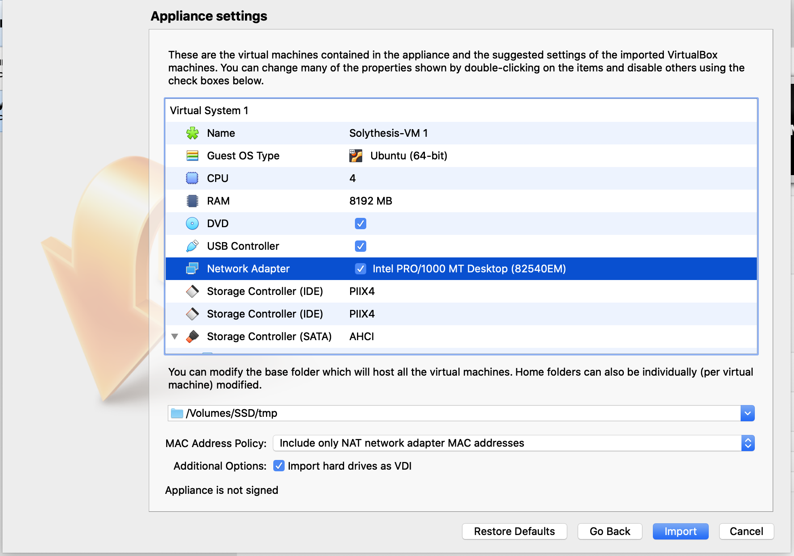

## Start

- To evaluate Solythesis, please download our pre-configured [VM image](./) and [VirtualBox](https://www.virtualbox.org/).

- Open VirtualBox, select File-Import Appliance, and import the VM image.

- Make sure you have 200 GB free disk space, setting your VM accordingly, and select import.

- Start and login VM.
  - username: `ubuntu`
  - password: `ubuntu`

- Open terminal.

- `cd solythesis-artifact`

## Experiments

- To use solythesis compiler, go to `solythesis` folder and read the `README.md` file.

- To reproduce our experiments run

- `python3 ./run.py` and follows the instructions:

  - Select the contract to deploy
  - Select the type of instrumentation.
  - Select which type of experiment to run.
  - Select the number of blocks to generate (Note large block number may require lots of time to process).

  - The statics will be shown after the script finishes.

## Caveats

- The performance will be lower than the experiment results in paper since the experiments are performed in a virtual machine.

- If you cancel the experiments, make sure you kill all parity process before running other experiments.

- Don't run multiple experiments at the same time.
